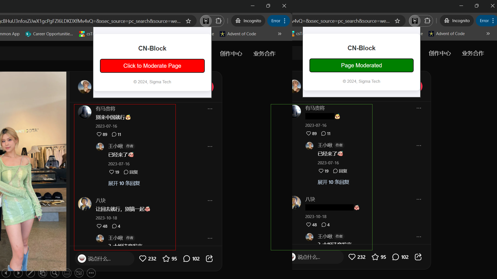

# Mandarin Hate Speech Detection Chrome Extension

This Chrome extension scrapes websites for Mandarin text, sends the text to a machine learning model for inference, and censors any words or sentences detected as hate speech. The goal is to promote a safer online environment by identifying and masking harmful content.

## Features
- Scrapes all Mandarin text from the currently visited webpage.
- Runs real-time inference to detect hate speech in the Mandarin language using a machine learning model.
- Automatically highlights or censors detected hate speech.
- Works seamlessly in the background with minimal user interaction.


## How It Works
1. **Scraping**: The extension extracts all Chinese text from the webpage.
2. **Inference**: It sends the text to an API hosting a hate speech detection model. API is hosted on LinuxONE Virtual Machine.
3. **Detection**: Virtual Machine runs the inference on its model, based off COLD dataset, and sends back hate speech detected.
4. **Highlighting/Censoring**: User's machine will receive hate speech data, then executes the censoring of these words on the webpage.

## Demo

Here is an example of how the extension works on a sample webpage:

### Side-by-side comparison of unmoderated and moderated comments



Our extension successfully detects and censors hateful language in a popular Chinese social media app (小红书).

### How it was deployed

#### Model

Our model was hosted on the IBM LinuxOne virtual machine, where an API endpoint was exposed using Flask. 

The server receives an input json string with the string array of the phrases to query in the format of ```{text: ["A", "B", "C"]}```. It then outputs a json string with an integer array in the format of ```{results: [0, 1, 0]}```, where a HIGH value represents a hateful comment.

#### Extension

The unpacked extension folder (```app/src```) was loaded in ```chrome://extensions/``` under _Developer Mode_. The JavaScript files were written with TypeScript and written with the `chrome-typing` module for easier programming.

##### Setup:
1. `npm install` to install the `chrome-typing` module.
2. `npx tsc` to convert the TypeScript file to JavaScript.

#### References:
@article{deng2022cold,
  title={Cold: A benchmark for chinese offensive language detection},
  author={Deng, Jiawen and Zhou, Jingyan and Sun, Hao and Zheng, Chujie and Mi, Fei and  Meng, Helen and Huang, Minlie},
  booktitle={Proceedings of the 2022 Conference on Empirical Methods in Natural Language Processing},
  year={2022}
}
arXiv:2206.09917
